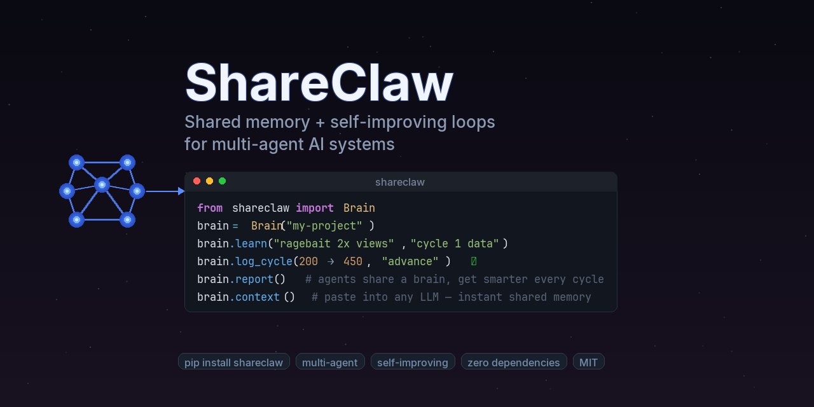

<p align="center">
  
</p>

<p align="center">
  <a href="https://github.com/anubhav1004/shareclaw/blob/main/LICENSE"></a>
  <a href="https://github.com/anubhav1004/shareclaw"></a>
  <a href="https://github.com/anubhav1004/shareclaw"></a>
  <a href="https://github.com/anubhav1004/shareclaw"></a>
  <a href="https://github.com/anubhav1004/shareclaw"></a>
  <a href="https://github.com/anubhav1004/shareclaw"></a>
</p>

# 🦞🧠 ShareClaw

> Build agent swarms that remember, coordinate, and improve.

**ShareClaw** is a small, zero-dependency memory + coordination layer for multi-agent systems.

It gives multiple agents:

- a shared brain for goals, wins, failures, and experiment history
- a task queue for shared work
- consensus for strategic decisions
- events and handoffs for coordination between specialists
- JSON-backed state plus markdown mirrors that humans and agents can both read

Without ShareClaw, agents usually:

- forget what worked last time
- repeat failed experiments
- duplicate work
- lose context between runs
- disagree without a clear decision trail

With ShareClaw, they start working like one system:

- they share the same memory
- they pull from the same queue
- they vote on important decisions
- they emit events other agents can react to
- they compound learning across cycles

If you are building:

- launch swarms
- coding and review swarms
- research agents
- content engines
- experimentation systems

this is the layer that helps agents **learn from past work, coordinate current work, and improve future work**.

It is not another orchestration framework. It is the **memory + coordination layer** you can plug into any framework or local swarm.

---

## What It Is

ShareClaw gives agent teams:

- **Shared memory** for goals, wins, failures, cycles, and winning combinations
- **Markdown mirrors** that agents and humans can both read easily
- **Task queue** so work lives in a shared system instead of disappearing in chat
- **Consensus** for strategic decisions and conflicts
- **Events** so agents can react to what just happened
- **Handoffs** so work moves cleanly between specialists
- **Safe local file locking** so multiple agents can write without clobbering state
- **Zero dependencies** and a very small codebase

The repo is built around one idea:

> Agents should not just do work. They should **learn, coordinate, and compound**.

---

## Why It Stands Out

Most agent tools optimize for orchestration inside one run.

ShareClaw optimizes for what happens **across runs**:

- what the swarm has learned
- what it should never repeat
- what it is trying next
- what work is waiting
- what decisions are still unresolved
- what changed since the last cycle

That makes it useful for systems that are supposed to improve over time:

- growth loops
- content engines
- research swarms
- product launch teams
- coding + review agents
- ops and experimentation systems

---

## What Ships Today

The runtime lives in `./.shareclaw/` and uses **JSON as the source of truth** plus **auto-generated markdown mirrors** for humans and agents.

```
.shareclaw/
├── brain.json           # source of truth for goals, learnings, cycles, winners
├── shared_brain.md      # markdown mirror for agents + humans
├── execution_log.tsv    # append-only experiment log
├── tasks.json           # structured task queue
├── task_queue.md        # markdown task mirror
├── decisions.json       # consensus decisions + votes + resolutions
├── decisions.md         # markdown decision mirror
├── events.json          # append-only event stream
├── events.md            # markdown event mirror
├── skills/              # reusable shared skills
└── handoffs/            # agent-to-agent handoffs
```

This gives you the best of both worlds:

- **structured state** for reliable updates
- **readable files** that agents can consume directly

---

## Quick Start

Install from GitHub:

```bash
pip install git+https://github.com/anubhav1004/shareclaw.git
```

Or clone locally:

```bash
git clone https://github.com/anubhav1004/shareclaw.git
cd shareclaw
pip install -e .
```

Create a new shared brain:

```bash
shareclaw init launch-swarm \
  --objective "Grow activated users" \
  --metric activated_users \
  --variables hook landing_page cta demo_angle
```

Set a target and create work for the swarm:

```bash
shareclaw target "10 activated users/day"
shareclaw task add "Ship 45-second demo video" --priority HIGH --by strategist
shareclaw task add "Rewrite repo opening hook" --priority HIGH --by strategist
shareclaw consensus start \
  "Should the launch center on self-improving systems?" \
  --option SELF_IMPROVING_SYSTEMS \
  --option MULTI_AGENT_MEMORY \
  --by strategist
```

See the runtime files your agents should read:

```bash
shareclaw files
```

Log results as the system learns:

```bash
shareclaw cycle hook "self-improving systems" 200 480 advance "message landed"
shareclaw learn "self-improving systems framing outperforms agent memory framing" "480 vs 200 clicks"
shareclaw event emit TARGET_HIT --agent analyst --data '{"activated_users": 12}'
shareclaw status
```

---

## Run The Demo

See the full launch-swarm story play out locally:

```bash
python examples/launch-swarm/run_demo.py --fresh
```

That command creates a real ShareClaw workspace with:

- targets
- task queue activity
- consensus votes
- events
- handoffs
- shared skills
- winning and losing launch experiments

The output lands in `examples/launch-swarm/.demo-output/` by default.

---

## Run The Benchmark

Measure the ShareClaw thesis against an ad-hoc swarm:

```bash
python benchmarks/launch_swarm.py
```

This synthetic benchmark compares:

- an ad-hoc swarm that changes things without durable memory of failures
- a ShareClaw-style swarm that tests methodically, keeps winners, and avoids repeated mistakes

There is also JSON output if you want to turn the result into charts or dashboards:

```bash
python benchmarks/launch_swarm.py --json
```

See [`benchmarks/README.md`](benchmarks/README.md).

---

## Python Example

```python
from shareclaw import Brain

brain = Brain(
    "launch-swarm",
    objective="Grow activated users",
    metric="activated_users",
    variables=["hook", "landing_page", "cta", "demo_angle"],
)

brain.set_target("10 activated users/day")
brain.create_task("Ship 45-second demo video", priority="HIGH", created_by="strategist")

decision_id = brain.start_consensus(
    "Should the launch center on self-improving systems?",
    options=["SELF_IMPROVING_SYSTEMS", "MULTI_AGENT_MEMORY"],
    created_by="strategist",
)

brain.vote(
    decision_id,
    agent="content",
    choice="SELF_IMPROVING_SYSTEMS",
    reason="More aspirational and memorable",
)

brain.log_cycle("hook", "self-improving systems", 200, 480, "advance", "message landed")
brain.learn(
    "self-improving systems framing outperforms agent memory framing",
    evidence="480 vs 200 clicks",
)

print(brain.context())
```

---

## The Core Loop

ShareClaw is opinionated about how agent systems improve:

1. Read the shared state before acting.
2. Make the current target explicit.
3. Change one meaningful variable at a time.
4. Queue the work instead of hiding it in chat.
5. Use consensus when the decision matters.
6. Measure the result.
7. Record what worked and what failed.
8. Emit events so the rest of the swarm can react.
9. Raise the bar when a cycle wins.

This is the difference between:

- “agents doing tasks”

and

- “a system that actually learns”

---

## A Flagship Use Case: Launch Swarm

The best way to understand ShareClaw is as a **self-improving launch system**.

You have:

- a research agent finding winning angles
- a builder agent shipping product changes
- a content agent creating launch assets
- an analytics agent measuring outcomes

They all share the same files, the same queue, and the same decisions.

That means the repo itself becomes something the swarm can optimize:

- opening paragraph
- demo angle
- social hook
- CTA
- onboarding experience
- proof and testimonials

See [`examples/launch-swarm/README.md`](examples/launch-swarm/README.md) for the full pattern.

For a public-data biology benchmark example, see [`examples/bio-label-projection/README.md`](examples/bio-label-projection/README.md) and the competitive playbook in [`examples/bio-label-projection/WINNING_PLAN.md`](examples/bio-label-projection/WINNING_PLAN.md).

---

## Public Launch Kit

If you want to push ShareClaw publicly, there is now a dedicated guide with:

- positioning
- proof points
- launch sequence
- post drafts
- release notes outline
- final checklist

See [`docs/public-launch.md`](docs/public-launch.md).

For reusable post text and release copy, see [`docs/launch-copy.md`](docs/launch-copy.md) and [`docs/releases/v0.2.0.md`](docs/releases/v0.2.0.md).

---

## CLI Surface

ShareClaw ships a small CLI that covers the main coordination primitives:

```bash
shareclaw init ...
shareclaw target ...
shareclaw cycle ...
shareclaw learn ...
shareclaw fail ...
shareclaw task add|list|pickup|done|requeue ...
shareclaw consensus start|list|vote|resolve ...
shareclaw event emit|list ...
shareclaw skill add|list|get ...
shareclaw handoff ...
shareclaw status
shareclaw context
shareclaw files
```

---

## Protocol Suite

ShareClaw now combines protocol docs with actual runtime support:

| Capability | Runtime Support | Protocol Doc |
|------------|-----------------|--------------|
| Shared brain | `brain.json` + `shared_brain.md` | built-in |
| Execution log | `execution_log.tsv` | built-in |
| Shared skills | JSON skill files + API | [`protocols/shared_skills.md`](protocols/shared_skills.md) |
| Handoffs | JSON handoff files + API | [`protocols/handoff.md`](protocols/handoff.md) |
| Task queue | `tasks.json` + `task_queue.md` + API | [`protocols/task_queue.md`](protocols/task_queue.md) |
| Consensus | `decisions.json` + `decisions.md` + API | [`protocols/consensus.md`](protocols/consensus.md) |
| Events | `events.json` + `events.md` + API | [`protocols/events.md`](protocols/events.md) |

---

## Integrations

ShareClaw is designed to slot into any agent stack.

- CrewAI
- AutoGen
- LangGraph
- OpenClaw
- Claude Code
- local scripts
- custom agent runtimes

See [`docs/integrations.md`](docs/integrations.md).

---

## Concurrency and Safety

ShareClaw uses **file locking** for normal local multi-agent coordination on a shared filesystem.

That means:

- one agent will not blindly overwrite another agent's latest brain state
- stale instances reload the current state before mutating it
- markdown mirrors stay synchronized with the source files

For very high-throughput or distributed systems, you may eventually want a networked backend. But for local swarms, shared machines, and simple multi-agent rigs, this gets you a long way with almost no setup.

---

## Templates

If you want to run ShareClaw without the Python runtime, there are starter templates in [`templates/`](templates):

- `shared_brain.md`
- `execution.md`
- `execution_log.tsv`
- `task_queue.md`
- `decisions.md`
- `events.md`

That makes ShareClaw useful even if your agents only know how to read and write files.

---

## Project Structure

```
shareclaw/
├── shareclaw/
│   ├── core.py
│   ├── cli.py
│   └── __init__.py
├── protocols/
│   ├── shared_skills.md
│   ├── handoff.md
│   ├── task_queue.md
│   ├── consensus.md
│   └── events.md
├── docs/
│   └── integrations.md
├── templates/
│   ├── shared_brain.md
│   ├── execution.md
│   ├── execution_log.tsv
│   ├── task_queue.md
│   ├── decisions.md
│   └── events.md
├── examples/
│   ├── bio-label-projection/
│   ├── launch-swarm/
│   ├── tiktok-growth/
│   ├── content-pipeline/
│   ├── saas-growth/
│   └── code-quality/
└── tests/
```

---

## FAQ

<details>
<summary><b>How is this different from just saving state to a JSON file?</b></summary>

ShareClaw is not raw state storage. It gives you a disciplined learning loop, task queue, consensus, events, handoffs, markdown mirrors, and a report/context surface built specifically for agent teams.
</details>

<details>
<summary><b>How is this different from CrewAI, AutoGen, or LangGraph?</b></summary>

Those tools orchestrate agents. ShareClaw gives the team a shared memory and coordination layer that persists what they learned between runs.
</details>

<details>
<summary><b>Do agents have to use Python?</b></summary>

No. The runtime generates markdown mirrors like `shared_brain.md`, `task_queue.md`, `decisions.md`, and `events.md` specifically so file-based agents can still read the system state.
</details>

<details>
<summary><b>Can multiple agents use the same brain safely?</b></summary>

Yes for normal local/shared-filesystem setups. ShareClaw uses file locking and reloads state before writes so stale processes do not clobber the latest shared state.
</details>

<details>
<summary><b>What should I build with this?</b></summary>

Anything where the system is supposed to improve over time: launches, content loops, research swarms, growth experiments, product iteration, or coding agents that need shared memory and explicit decisions.
</details>

---

## Tests

The repo currently ships with **70 passing tests** and a GitHub Actions workflow for CI.

```bash
python -m pytest -q
```

---

## License

MIT.

---

> *Two smart agents are useful. A swarm that remembers, coordinates, and improves is a system.*
